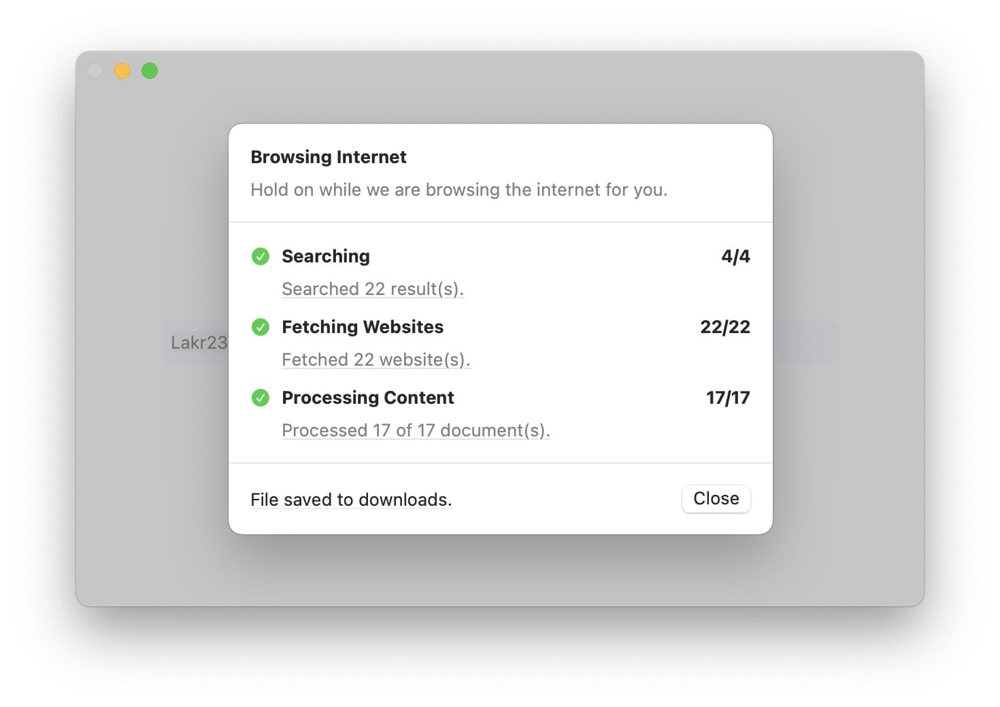

# ScrubberKit

ScrubberKit is a robust framework designed to scrape and process web content using keywords, transforming complex HTML pages into clean, plain text suitable for AI model consumption.



## Features

- Keyword-based web content discovery
- SwiftSoup-based HTML parsing and cleaning
- Plain text extraction optimized for AI consumption
- Cross-platform support (iOS, macOS, macCatalyst, visionOS)
- Asynchronous operations for efficient performance
- Automatically block font and media resources
- Battle tested inside [FlowDown](https://github.com/Lakr233/FlowDown-App)

## Requirements

- iOS 13.0+
- macOS 10.15+
- macCatalyst 13.0+
- visionOS 1.0+
- Swift 5.9+

## Installation

### Swift Package Manager

Add ScrubberKit to your project by adding it as a dependency in your `Package.swift` file:

```swift
dependencies: [
    .package(url: "https://github.com/Lakr233/ScrubberKit.git", from: "1.0.0")
]
```

## Usage

```swift
import ScrubberKit

let scrubber = Scrubber(query: "Asspp")
scrubber.run { result in
    print("\(result.count)")
} onProgress: { progress in
    print("\(progress)")
}

```

## License

ScrubberKit is available under the MIT license. See the LICENSE file for more information.

---

© Lakr Aream 2025. All rights reserved.
